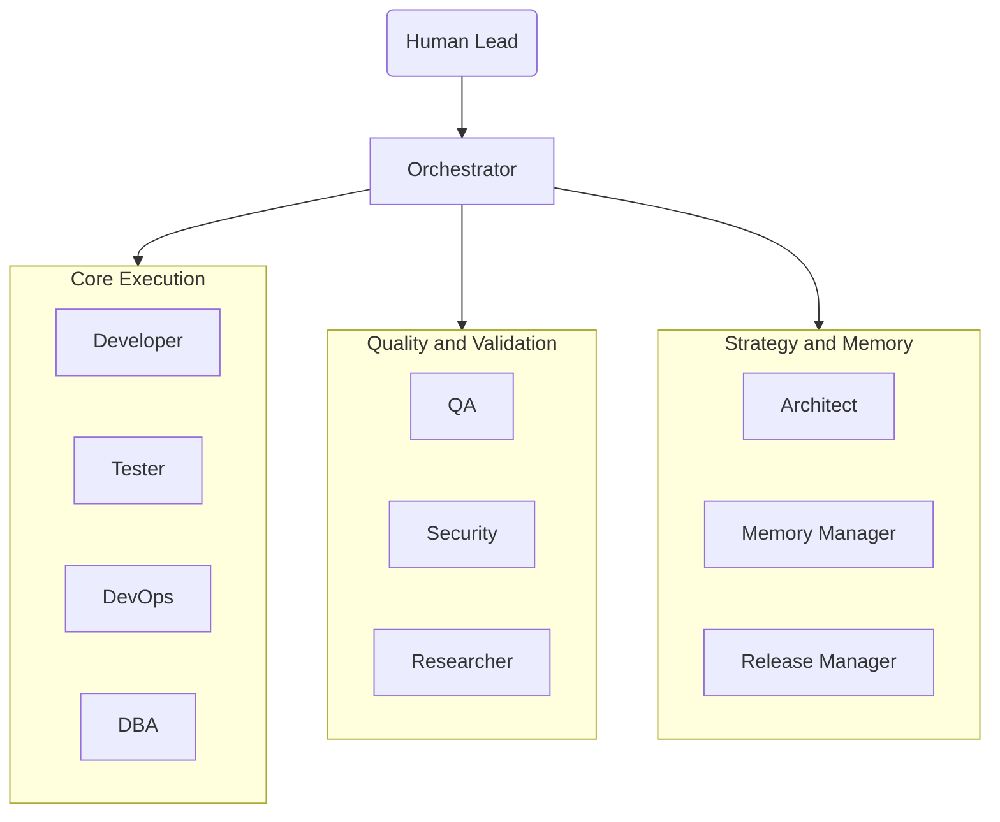
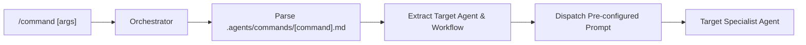

# Dev-OS — Engineering OS

*A multi-agent Engineering Operating System for AI-assisted software development*

**by Clement Olives · Olives Technologies**


```bash
npx @olitech010/dev-os init
```

---

## Table of Contents

- [1. Executive Summary](#1-executive-summary)
- [2. Quick Start & Complete Setup Guide](#2-quick-start--complete-setup-guide)
  - [Prerequisites](#prerequisites)
  - [Step 1: Install Dev-OS Into Your Project](#step-1-install-dev-os-into-your-project)
  - [Step 2: Install Mechanical Pre-Commit Hooks](#step-2-install-mechanical-pre-commit-hooks)
  - [Step 3: Secret Scanner Verification](#step-3-secret-scanner-verification)
  - [Step 4: Verify Installation](#step-4-verify-installation)
  - [CLI Command Reference](#cli-command-reference)
- [3. Agent Roster & Team Architecture](#3-agent-roster--team-architecture)
- [4. Slash Commands Reference](#4-slash-commands-reference)
  - [Command List & Usage](#command-list--usage)
  - [Creating Custom Slash Commands](#creating-custom-slash-commands)
- [5. Workflow Protocols & Delivery Cycles](#5-workflow-protocols--delivery-cycles)
  - [Standard Feature Delivery (Parallel Quality Gate)](#standard-feature-delivery-parallel-quality-gate)
  - [Bug Fix Delivery Workflow](#bug-fix-delivery-workflow)
  - [Rollback Protocol](#rollback-protocol)
  - [Exploratory Refactoring](#exploratory-refactoring)
  - [Project Inception (Grill-Me)](#project-inception-grill-me)
- [6. Commit Model & Mechanical Gate Protocol](#6-commit-model--mechanical-gate-protocol)
  - [Staged Review Model](#staged-review-model)
  - [How `commit.sh` Works](#how-commitsh-works)
  - [Mechanical Pre-Commit Hook & Secret Scanning](#mechanical-pre-commit-hook--secret-scanning)
- [7. Memory System & Context Management](#7-memory-system--context-management)
  - [Working Memory (`CURRENT_STATE.md`)](#working-memory-current_statemd)
  - [Episodic Memory (`LESSONS.md`)](#episodic-memory-lessonsmd)
  - [Pinned Safety Rules](#pinned-safety-rules)
  - [Circuit Breaker Protocol (Rule #10)](#circuit-breaker-protocol-rule-10)
- [8. System Architecture Diagrams](#8-system-architecture-diagrams)
- [9. Directory Structure](#9-directory-structure)
- [10. Best Practices & Troubleshooting](#10-best-practices--troubleshooting)
- [11. Documentation](#11-documentation)

---

## 1. Executive Summary

**Dev-OS** is an AI-augmented Engineering Operating System that turns AI coding assistants into a structured, multi-agent development team. Instead of interacting with a generic chatbot that makes unvalidated commits or leaks secrets, Dev-OS enforces a rigorous software development lifecycle.

### Why Dev-OS?

- **Zero Direct Commit Bypass:** AI agents cannot execute raw `git commit` or `git push`. All code changes route through QA verification, human inspection, and mechanical pre-commit gates.
- **Specialized Agent Roster:** 11 dedicated agent personas (Developer, QA, Tester, Security, DBA, DevOps, Architect, Researcher, Memory Manager, Release Manager, Orchestrator) handle distinct stages of delivery.
- **Parallel Quality Gates:** QA (standards), Tester (unit/integration tests), and Security (vulnerabilities) evaluate code concurrently.
- **Persistent Memory & State:** Prevents agent "amnesia" through state tracking (`CURRENT_STATE.md`), lessons learned (`LESSONS.md`), and pinned safety rules.
- **Slash Command Interface:** 10 pre-configured commands (`/review`, `/commit`, `/test`, `/secure`, `/research`, etc.) for zero-friction task execution.

---

## 2. Quick Start & Complete Setup Guide

Follow this step-by-step walkthrough to set up and verify Dev-OS in any repository.

### Prerequisites

- **Git** (v2.20+)
- **Bash** (v4.0+)
- **Node.js** (v18+)
- **Gitleaks** (Recommended for automated secret scanning):
  ```bash
  # macOS (Homebrew)
  brew install gitleaks

  # Linux / WSL
  sudo snap install gitleaks
  ```

### Step 1: Install Dev-OS Into Your Project

Run the installer **from the root of your own project** (new or existing). Pick any of the three options:

**Option A — npm registry (recommended):**

```bash
# One-off run (no install)
npx @olitech010/dev-os init

# Or install globally, then use the `devos` command anywhere
npm install -g @olitech010/dev-os
devos init
```

> [!NOTE]
> The npm package is named **`@olitech010/dev-os`** — scoped, because the name `devos` on npm belongs to an unrelated 2016 package and npm blocks unscoped look-alike names. Once installed, the command you type is simply `devos`.

**Option B — straight from GitHub (no registry needed):**

```bash
npx github:olitech1010/dev-os init
```

**Option C — clone and link (development / offline):**

```bash
git clone https://github.com/olitech1010/dev-os.git
cd dev-os && npm link
cd /path/to/your-project && devos init
```

The interactive wizard asks two questions (fresh vs. existing project, and your technology stack), then installs:

- `.agents/` — the full agent roster, 60 specialist skills, slash-command definitions, and enforcement scripts
- `.claude/commands/` + `.claude/agents/` — generated Claude Code slash commands and subagents (skip with `--no-claude`)
- `CLAUDE.md` — project bootstrap for Claude Code (appended if one already exists)
- `docs/` and `CODING_STANDARDS.md` — only for fresh projects or when absent
- A `.gitignore` rule for `.agents/_backup/` — re-running `init` backs up your existing `.agents/` to `.agents/_backup/<timestamp>/` before updating

Non-interactive setup:

```bash
npx @olitech010/dev-os init --existing --stack nextjs
```

### Step 2: Install Mechanical Pre-Commit Hooks

Dev-OS uses a mechanical Git pre-commit hook to physically block raw `git commit` commands and prevent hardcoded secret leaks. Install it by running:

```bash
./.agents/scripts/install-hooks.sh
```

### Step 3: Secret Scanner Verification

Verify that Gitleaks is installed and operational:

```bash
gitleaks version
```

> [!NOTE]
> If Gitleaks is not installed on the host machine, the pre-commit hook will issue a warning and continue enforcing the `DEVOS_COMMIT_APPROVED` token gate. Installing Gitleaks enables automated binary secret scanning.

### Step 4: Verify Installation

Run the built-in diagnostic tool to confirm environment readiness:

```bash
devos doctor
```

Expected output:
```
Diagnostic Summary: 8/8 required checks passed.
[ OK ] Dev-OS environment is fully operational.
```

`doctor` exits with a non-zero code when a required check fails, so it can gate CI pipelines. Optional items (the pre-commit hook and Claude Code integration) are reported as `[ WARN ]` without failing the run.

### CLI Command Reference

| Command | Aliases | Description |
|---|---|---|
| `devos init` | `setup` | Install or update Dev-OS in the current project (interactive wizard) |
| `devos doctor` | `check` | Diagnose setup, permissions, commit gate, and Claude Code integration |
| `devos list` | `agents`, `skills` | Show installed agent personas and specialist skills |
| `devos status` | — | One-screen summary of the project's Dev-OS state |
| `devos version` | `-v` | Print CLI version and environment info |
| `devos help` | `-h` | Full command reference |

| Flag | Description |
|---|---|
| `-s, --stack <name>` | Target stack: `nextjs`, `laravel`, `django`, `react-native`, `express`, `fastapi`, `universal` |
| `--fresh` / `--existing` | Non-interactive fresh or existing project initialization |
| `--no-claude` | Skip generating `.claude/` (Claude Code commands & agents) |
| `--json` | Machine-readable output for `doctor`, `list`, and `status` |
| `-q, --quiet` | Suppress the banner and non-essential output |

---

## 3. Agent Roster & Team Architecture

Dev-OS organizes AI capabilities into 11 distinct roles. Every agent operates under strict boundary constraints defined in `.agents/agents/`.

| Agent | Prompt File | Primary Responsibility | Key Rule |
|---|---|---|---|
| **Orchestrator** | `agents/orchestrator.md` | Tech lead. Triages tasks, delegates to specialists, manages loops. | **NEVER** writes code or runs `git commit` directly. |
| **Developer** | `agents/developer.md` | Feature implementation and bug fixing. | Writes code, never auto-commits. Presents work for Staged Review. |
| **QA** | `agents/qa.md` | Quality gatekeeper. Reviews code quality, standards, and test results. | Does **NOT** write tests. Approves or requests changes with itemized feedback. |
| **Tester** | `agents/tester.md` | Test creation and execution. | Owns test creation (happy path, edge cases, regressions). Never fixes implementation code. |
| **Security** | `agents/security.md` | Security vulnerability scanner. | Audits OWASP Top 10, auth logic, input sanitization, dependencies, and secret leaks. |
| **Architect** | `agents/architect.md` | System design & interrogation. | Uses `grill-me` skill to turn vague ideas into `PROJECT_REQUIREMENTS.md`. |
| **DBA** | `agents/dba.md` | Database architecture & migrations. | Writes schema migrations and RLS policies. Requires dry-run plan before execution. |
| **DevOps** | `agents/devops.md` | Infrastructure & CI/CD deployment. | Follows deployment checklists. **NEVER** touches production without explicit human approval. |
| **Researcher** | `agents/researcher.md` | Facts and documentation lookup. | Confirms package versions, API signatures, CVEs, and deprecations before Dev implements. |
| **Memory Manager** | `agents/memory-manager.md` | State tracking & context preservation. | Maintains `CURRENT_STATE.md` and `LESSONS.md`. Handles context compaction and handoffs. |
| **Release Manager** | `agents/release-manager.md` | Release engineering & changelogs. | Manages semver bumps, updates `CHANGELOG.md`, and writes human-readable release notes. |

---

## 4. Slash Commands Reference

Slash commands provide pre-configured, metadata-driven shortcuts for common agent tasks. They bypass manual prompt typing and route directly to the target agent.

### Command List & Usage

| Command | Target Agent | Triage Level | Description & Usage Example |
|---|---|---|---|
| `/review` | **QA** | `STANDARD` | Run comprehensive code review on staged or specified files.<br>`/review src/components/AuthForm.tsx` |
| `/commit` | **Developer** | `TRIVIAL` | Execute human-approved commit via `.agents/scripts/commit.sh` (stage with `git add` first — the script does not stage).<br>`/commit feat: add user profile page` |
| `/test` | **Tester** | `STANDARD` | Generate and run unit/integration tests for target module.<br>`/test src/services/payment.ts` |
| `/secure` | **Security** | `STANDARD` | Perform security scan for vulnerabilities and secret leaks.<br>`/secure` |
| `/research` | **Researcher** | `TRIVIAL` | Search documentation, verify API signatures, check CVEs.<br>`/research Next.js 15 App Router server actions` |
| `/status` | **Orchestrator** | `TRIVIAL` | Generate project state update from `CURRENT_STATE.md`.<br>`/status` |
| `/fix` | **Developer** | `STANDARD` | Trigger Bug Fix delivery workflow for specified issue.<br>`/fix Login button fails on mobile Safari` |
| `/architect` | **Architect** | `STANDARD` | Run `grill-me` inception interview to produce `PROJECT_REQUIREMENTS.md`.<br>`/architect Build real-time analytics dashboard` |
| `/refactor` | **Developer** | `STANDARD` | Refactor the specified code scope through the standard delivery workflow.<br>`/refactor Rewrite database client to use Drizzle ORM` |
| `/deploy` | **DevOps** | `CRITICAL` | Execute pre-deployment checklist and present deployment plan.<br>`/deploy staging` |

### Creating Custom Slash Commands

To add a new command, create a Markdown file in `.agents/commands/` with YAML frontmatter:

```markdown
---
name: my-command
description: Short description for the command picker
agent: target-agent-name
triage_level: TRIVIAL | STANDARD | CRITICAL
workflow: standard | bugfix | inception | direct
---

Pre-configured prompt sent to the agent.
Use $ARGUMENTS to reference arguments passed after the slash command.
```

After adding or editing commands, re-run `devos init` — it regenerates the native Claude Code versions in `.claude/commands/` from your `.agents/commands/` sources.

---

## 5. Workflow Protocols & Delivery Cycles

### Standard Feature Delivery (Parallel Quality Gate)

```
1. Orchestrator receives task → breaks into subtasks
2. Researcher → confirms library versions, APIs, and dependencies
3. Developer → implements code changes (does NOT commit — presents for Staged Review)
4. PARALLEL GATE (simultaneous execution):
   ├─► QA → reviews code quality, conventions, and standards
   ├─► Tester → writes and executes test suite
   └─► Security → scans for vulnerabilities and secret exposures
5. Orchestrator → collects verdicts. If any agent rejects, routes back to Developer (Circuit Breaker: max 3 loops)
6. HUMAN CHECKPOINT → Human tests in browser / inspects code → Approves
7. Developer → commits via .agents/scripts/commit.sh
8. DevOps → prepares deployment plan (requires Human approval)
```

### Bug Fix Delivery Workflow

```
1. Researcher → reproduces bug and investigates root cause
2. Developer → implements fix (presents changes for review)
3. Tester → writes regression test first, verifies fix passes
4. QA → approves code quality and standards
5. HUMAN CHECKPOINT → Human tests fix in browser
6. Developer → commits via commit.sh
7. DevOps → deploys fix
```

### Rollback Protocol

```
1. DevOps → identifies failing deployment or critical regression
2. Orchestrator → halts all in-progress work on affected branch
3. Developer → reverts to last known good commit (`git revert` or branch reset)
4. Tester → runs full regression suite to confirm stability
5. QA → approves rollback state
6. HUMAN CHECKPOINT → approve rollback deployment
7. DevOps → deploys rollback
8. Orchestrator → logs incident in `docs/LESSONS.md`
```

### Exploratory Refactoring

```
1. Developer → creates throwaway exploration branch (`explore/*`)
2. Developer → experiments with structural changes (bypasses QA during exploration)
3. Developer → presents findings and architecture diff to Orchestrator
4. HUMAN CHECKPOINT → approve or discard exploration
5. If Approved → Developer implements clean version on feature branch → Standard Feature Delivery
6. If Discarded → Developer deletes exploration branch
```

### Project Inception (Grill-Me)

```
1. Orchestrator receives high-level project idea
2. Architect → runs `.agents/skills/grill-me/SKILL.md` in single-shot execution
   ↳ Extrapolates technical constraints, edge cases, and non-technical needs
   ↳ Generates `docs/PROJECT_REQUIREMENTS.md`
3. HUMAN CHECKPOINT → review, modify, and approve requirements
4. Orchestrator → initiates delivery based on approved spec
```

---

## 6. Commit Model & Mechanical Gate Protocol

### Staged Review Model

Dev-OS operates under a **Staged Review** model to give humans complete control before any code enters Git history:

1. **No Auto-Commits:** AI agents modify code files locally but **never run `git commit` directly**.
2. **Human Inspection:** After implementation, the Developer presents a summary of changes.
3. **Browser / Logic Testing:** The human tests the application UI, functionality, and logic in the browser.
4. **Triggered Commit:** Once satisfied, the human triggers `/commit` or runs `.agents/scripts/commit.sh`.

### How `commit.sh` Works

The script [commit.sh](.agents/scripts/commit.sh) enforces human verification and conventional commits (stage your changes with `git add` first — the script does not stage):

```bash
# Workflow executed by commit.sh:
1. Prompts for Human Approval Token ("approve")
2. Prompts for Commit Type (feat, fix, docs, refactor, perf, style, test, chore)
3. Prompts for Commit Message
4. Exports environment variable: export DEVOS_COMMIT_APPROVED=true
5. Executes: git commit -m "$type: $message"
```

### Mechanical Pre-Commit Hook & Secret Scanning

When `git commit` executes, Git triggers `.git/hooks/pre-commit`:

```
git commit
   │
   ▼
.git/hooks/pre-commit
   │
   ├── 1. Check DEVOS_COMMIT_APPROVED token
   │      ↳ If missing: [ FAIL ] ABORT ("Direct 'git commit' disabled. Use commit.sh")
   │
   └── 2. Run Gitleaks Secret Scan
          ↳ If secret/key found: [ FAIL ] ABORT ("Hardcoded secret detected")
          ↳ If clean: [ OK ] COMMIT SUCCESSFUL
```

---

## 7. Memory System & Context Management

To prevent agents from "forgetting" instructions during long sessions, Dev-OS implements a **3-tier memory system**:

```
 ┌────────────────────────────────────────────────────────┐
 │ 1. Pinned Safety Rules (In System Prompt - Never Lost)  │
 ├────────────────────────────────────────────────────────┤
 │ 2. Working Memory (docs/CURRENT_STATE.md - Task State) │
 ├────────────────────────────────────────────────────────┤
 │ 3. Episodic Memory (docs/LESSONS.md - Incident Logs)   │
 └────────────────────────────────────────────────────────┘
```

### Working Memory (`CURRENT_STATE.md`)

Location: `docs/CURRENT_STATE.md`  
Maintained by: **Memory Manager** (the Orchestrator updates it when the Memory Manager is not active)  

Tracks active task, branch name, current triage level, agent statuses, recent decisions, blockers, and context summaries across phase transitions.

### Episodic Memory (`LESSONS.md`)

Location: `docs/LESSONS.md`  
Maintained by: **Memory Manager** (all agents contribute entries; the Orchestrator updates it when the Memory Manager is not active)  

Logs significant errors, root causes, and resolutions. Before starting work in any domain (Auth, Database, Git, UI), agents query `LESSONS.md` to avoid repeating past mistakes.

### Pinned Safety Rules

The following hard rules are pinned in agent system prompts and can **never** be truncated:

1. **Mechanical Commit Gate:** All commits must route through `.agents/scripts/commit.sh`. Raw `git commit` is forbidden.
2. **Zero Hardcoded Secrets:** Never write API keys or credentials into code files; use `process.env.*`.
3. **No Destructive Actions Without Plan:** `DROP`, `TRUNCATE`, `DELETE`, or deployment actions require a dry-run plan.
4. **Human Checkpoint:** Human approval is mandatory before any commit, deployment, or database migration.

### Circuit Breaker Protocol (Rule #10)

> [!WARNING]
> If any agent loop (e.g., Developer ↔ QA, Developer ↔ Tester) exceeds **3 iterations** on the same task without resolution:
> 1. Orchestrator **HALTS** the loop immediately.
> 2. Compiles a diagnostic summary of all failed attempts and logs.
> 3. Escalates to the **Human** for guidance.

---

## 8. System Architecture Diagrams

### Agent Communication & Hierarchy



### Slash Command Routing Pipeline



---

## 9. Directory Structure

```
dev-os/
├── .agents/                    # Core Dev-OS Agentic System
│   ├── AGENTS.md               # Master system rules and agent roster
│   ├── README.md               # Agents directory guide
│   ├── agents/                 # System prompts for 11 agents
│   │   ├── architect.md
│   │   ├── dba.md
│   │   ├── developer.md
│   │   ├── devops.md
│   │   ├── memory-manager.md
│   │   ├── orchestrator.md
│   │   ├── qa.md
│   │   ├── release-manager.md
│   │   ├── researcher.md
│   │   ├── security.md
│   │   └── tester.md
│   ├── commands/               # Slash command definitions
│   │   ├── README.md
│   │   ├── architect.md
│   │   ├── commit.md
│   │   ├── deploy.md
│   │   ├── fix.md
│   │   ├── refactor.md
│   │   ├── research.md
│   │   ├── review.md
│   │   ├── secure.md
│   │   ├── status.md
│   │   └── test.md
│   ├── scripts/                # Mechanical enforcement tools
│   │   ├── commit.sh           # Human checkpoint & commit wrapper
│   │   └── install-hooks.sh    # Pre-commit hook installer
│   └── skills/                 # Specialist agent skills (60 skills)
├── bin/
│   └── devos.js                # Dev-OS CLI (installer, doctor, list, status)
├── scripts/
│   └── smoke-test.js           # End-to-end install & integrity test (npm test)
├── docs/                       # Project documentation & memory
│   ├── ARCHITECTURE.md         # Full architecture specification
│   ├── CHANGELOG.md            # Semantic version log (canonical)
│   ├── CURRENT_STATE.md        # Active project state tracker
│   ├── GETTING_STARTED.md      # Installation & CLI walkthrough
│   ├── LESSONS.md              # Episodic memory store
│   ├── SLASH_COMMANDS.md       # Complete slash command reference
│   └── TUTORIAL.md             # Detailed user onboarding guide
├── CHANGELOG.md                # Pointer to docs/CHANGELOG.md
├── CODING_STANDARDS.md         # Universal coding standards template
├── LICENSE                     # MIT
├── VERSION
├── package.json                # npm package: @olitech010/dev-os (bin: devos)
└── README.md                   # All-in-one Master Readme (This file)
```

Installed into *target* projects (by `devos init`): `.agents/`, `.claude/commands/`, `.claude/agents/`, `CLAUDE.md`, `CODING_STANDARDS.md`, `docs/` (fresh projects only), and a `.gitignore` rule for `.agents/_backup/`.

---

## 10. Best Practices & Troubleshooting

### Best Practices

1. **Run `devos doctor` after initial setup** to verify that scripts, directories, and hooks are correctly configured.
2. **Use Slash Commands** (`/review`, `/test`, `/secure`) to save tokens and trigger direct agent execution.
3. **Check `/status` periodically** during long debugging sessions to confirm active state in `CURRENT_STATE.md`.
4. **Never bypass `commit.sh`**. If a commit fails due to Gitleaks, revoke the exposed secret immediately on your provider platform.
5. **Respect the Circuit Breaker**. If agents trip the 3-loop limit, review their diagnostic summary rather than forcing a 4th automated retry.

### Troubleshooting

| Issue | Cause | Solution |
|---|---|---|
| `DEV-OS GATE ERROR: Direct 'git commit' is disabled` | `git commit` run directly without `commit.sh` | Run `.agents/scripts/commit.sh` instead of raw `git commit`. |
| `GITLEAKS ERROR: Hardcoded secret detected` | Staged file contains an API key or password | Remove the secret from code, use `process.env.KEY_NAME`, and revoke exposed key on provider. |
| Agent loops continuously without completing | Agent encountered edge case or failing test | Circuit Breaker will trip after 3 loops. Inspect `docs/CURRENT_STATE.md` or intervene manually. |
| `gitleaks: command not found` warning | Gitleaks binary not installed on host OS | Install Gitleaks (`brew install gitleaks`) for automated binary scanning. |

---

## 11. Documentation

For deep dives beyond this README:

- [Getting Started & CLI Guide](docs/GETTING_STARTED.md) — all installation options and the full CLI walkthrough
- [Tutorial](docs/TUTORIAL.md) — narrative onboarding for first-time users
- [Architecture](docs/ARCHITECTURE.md) — system diagrams and design rationale
- [Slash Commands Reference](docs/SLASH_COMMANDS.md) — per-command schema and usage
- [Changelog](docs/CHANGELOG.md) — release history

### Publishing to npm (maintainers)

```bash
npm test               # end-to-end smoke test must pass
npm pack --dry-run     # inspect the tarball contents
npm login              # one-time authentication
npm publish            # publishes @olitech010/dev-os to the registry
```

---

## License

[MIT License](LICENSE) — Copyright (c) 2026 Clement Olives — Olives Technologies.
