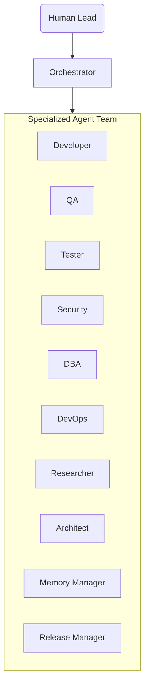

# Dev-OS — Engineering OS

*A multi-agent Engineering Operating System for AI-assisted software development*


## What is Dev-OS?

Dev-OS is a modern, multi-agent Engineering Operating System designed to augment software development teams. By treating AI agents not as generic chatbots but as specialized team members (Developer, QA, Tester, Security, etc.), Dev-OS enforces a rigorous software development lifecycle where no code is merged without passing through designated mechanical and AI-driven quality gates.

## Key Features

- **Agent Roster**: Specialized AI agents (Developer, QA, Tester, Security, DBA, DevOps, Researcher, Architect, Memory Manager, Release Manager) handle distinct phases of delivery.
- **Slash Commands**: 10 pre-configured commands (e.g., `/test`, `/review`) for quick task routing.
- **Memory System**: Project state tracking, episodic memory (`LESSONS.md`), and context preservation.
- **Mechanical Commit Gates**: Automated hooks and secret scanning (`gitleaks`) to prevent bad code or secrets from ever reaching production.
- **Parallel Quality Gates**: QA, Tester, and Security run simultaneously to speed up validation.

## Architecture Overview



## Quick Start

1. **Clone the repository** and navigate to the project directory.
2. **Install hooks**: Run `.agents/scripts/install-hooks.sh` to set up the mechanical commit gate.
3. **Invoke Dev-OS**: Talk to the Orchestrator agent to start a task, or use one of the predefined slash commands below.

## Slash Commands Quick Reference

| Command | Description |
|---|---|
| `/review` | Request a comprehensive code review from QA. |
| `/commit` | Trigger the autonomous commit workflow (`commit.sh`). |
| `/test` | Ask the Tester agent to generate or execute tests. |
| `/secure` | Request a security audit from the Security agent. |
| `/research` | Task the Researcher with finding docs, CVEs, or package info. |
| `/status` | Summarize the current project state via Memory Manager. |
| `/fix` | Initiate the Bug Fix workflow. |
| `/architect` | Incept a new feature or project using the Architect. |
| `/refactor` | Start an exploratory refactoring workflow on a throwaway branch. |
| `/deploy` | Trigger DevOps for deployment planning and execution. |

## Directory Structure

```
.
├── .agents/
│   ├── AGENTS.md               # Main agent roster and workflow rules
│   ├── README.md               # Overview of the .agents directory
│   ├── agents/                 # System prompts for each agent
│   ├── commands/               # Slash command definitions
│   ├── scripts/                # Utility scripts (commit.sh, install-hooks.sh)
│   └── skills/                 # Reusable agent skills
├── docs/
│   ├── ARCHITECTURE.md         # System architecture and workflows
│   ├── CHANGELOG.md            # Version history
│   ├── SLASH_COMMANDS.md       # Slash command reference
│   └── TUTORIAL.md             # Step-by-step user guide
└── README.md                   # This file
```

## Documentation

For deep dives, please read:
- [Tutorial](docs/TUTORIAL.md)
- [Architecture](docs/ARCHITECTURE.md)
- [Slash Commands Reference](docs/SLASH_COMMANDS.md)
- [Changelog](docs/CHANGELOG.md)

## License

[MIT License](LICENSE) (Placeholder)
