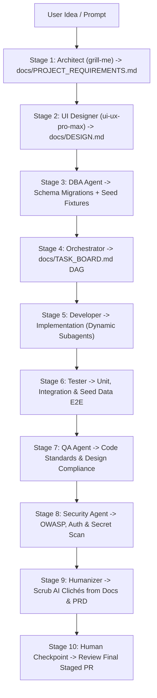

# Dev-OS v4.0 Research & Architectural Roadmap

**Document ID:** DEVOS-RES-2026-09-12  
**Author:** Antigravity & Olives Technologies Engineering OS  
**Status:** PROPOSED & UNDER RESEARCH  
**Scope:** Building upon the ECC/DeepSeek Gap Analysis (`docs/2026-09-03-devos-ecc-gap-analysis.md`) and addressing real-world field experience from production usage.

---

## 1. Executive Summary

Dev-OS v3.0.0 successfully laid the foundation for enterprise multi-agent workflows:
- **F1:** Runtime Lifecycle Hooks (`.agents/hooks/`, `.claude/hooks.json`).
- **F2:** Composable Capability Packs (`.agents/packs.json`, lean installs).
- **F3:** Structured Shared Memory Vault (`.agents/memory/`, ADRs, handoffs).
- **F4:** Deterministic Task Board DAG State (`docs/TASK_BOARD.md`, `/task`).
- **F5:** Multi-Platform Harness Expansion (Claude, Google Antigravity/Gemini, OpenCode, Cursor, Codex) with user-selectable targeting.

However, real-world development experience and analysis of the remaining items in the ECC/DeepSeek gap analysis reveal **five critical systemic problems** that currently hinder full autonomous leverage:

```
┌─────────────────────────────────────────────────────────────────────────────┐
│                       CURRENT REAL-WORLD PAIN POINTS                        │
├─────────────────────────────────────────────────────────────────────────────┤
│ 1. ORCHESTRATOR AMNESIA: Agents and skills are not mechanically enforced.   │
│    The model forgets to route tasks to specialists (Dev, QA, Tester, DBA)   │
│    and bypasses installed skills, collapsing into a single monolithic chat. │
│                                                                             │
│ 2. UNGOVERNED UI CODE: Developers jump straight into frontend code without   │
│    an established design system, resulting in generic "AI aesthetic" styling│
│    despite `ui-ux-pro-max` being installed. DESIGN.md is created manually.  │
│                                                                             │
│ 3. LACK OF FULL HANDS-OFF SDLC: No autonomous mode where an idea can be     │
│    given to the team, and an executive proxy oversees the full SDLC         │
│    (Inception → Design → Architecture/DB → Code → Test → QA → Security).   │
│                                                                             │
│ 4. SYNTHETIC AI CONTENT: Generated docs, marketing copy, and PRDs suffer    │
│    from robotic AI tells (forced triads, not-X-but-Y, hyperbolic fluff).    │
│                                                                             │
│ 5. STATIC ECOSYSTEM & LOST FEEDBACK: Skills/agents are frozen on disk with   │
│    no auto-update checks; failures and rule regressions are lost locally    │
│    instead of feeding improvements back to the Dev-OS core repository.      │
└─────────────────────────────────────────────────────────────────────────────┘
```

This research document defines the architecture, mechanical enforcement mechanisms, and implementation roadmap for **Dev-OS v4.0**.

---

## 2. Gap Analysis vs Field Experience Matrix

| Gap Analysis Recommendation | Field Problem Observed | Proposed v4.0 Solution |
|---|---|---|
| **Graph Engineering Core** | Orchestrator forgets to delegate; acts as a solo agent | **Mechanical Routing Enforcement Engine (MREE)** via `PreToolUse` hook + Task Board State Machine |
| **Handoff Contracts** | UI code created without design spec; missing seed data | **Mandatory Design Gate (`docs/DESIGN.md`)** & **Database Seed Protocol** |
| **Autonomous Workflows** | Human must micromanage every intermediate agent handoff | **Dev-OS Autonomous Executive Mode (`devos run` / `/auto`)** with dynamic subagent spawning |
| **Quality & Voice Standards** | Documentation and copy read like generic LLM prose | **Mechanical Humanizer Gate (`blader/humanizer`)** on all markdown prose |
| **Dynamic Capability Packs** | Skills are static; no sync with upstream repos | **Dynamic Skill & Upstream Registry Updater (`devos update --skills`)** |
| **Observability & Telemetry** | When Dev-OS breaks or loops, insights are trapped locally | **Autonomous Telemetry, RCA Engine & Auto-PR Feedback Loop** |

---

## 3. Pillar 1: Mechanical Agent & Skill Enforcement Engine

### 3.1 The Root Cause of "Orchestrator Amnesia"
Large Language Models naturally gravitate toward the path of least resistance: answering everything in a single generation. While the commit gate succeeded because `.git/hooks/pre-commit` and `.agents/scripts/commit.sh` are **hard binary shell scripts**, agent delegation and skill invocations have historically relied on **prompt instructions**. Prompt instructions can be bypassed or forgotten during high-context reasoning.

### 3.2 The Mechanical Enforcement Architecture
To guarantee agents and skills are used without human micromanagement, enforcement must move from *advisory text* to *runtime hook validation*:

```
User Prompt / Goal
       │
       ▼
[Task Board DAG Check] ──► Is active task queued in docs/TASK_BOARD.md?
       │                   If NO: Block tool calls until task is declared.
       ▼
[Role Authority Check] ──► Is tool caller acting as the assigned specialist?
       │                   - Developer cannot edit docs/DESIGN.md
       │                   - QA cannot author production code
       │                   - Architect cannot author migration SQL
       ▼
[Skill Invocation Check]─► Did the task declare a mandatory skill?
       │                   - UI Task: requires `ui-ux-pro-max`
       │                   - Documentation Task: requires `humanizer`
       │                   - Database Task: requires `supabase-postgres-best-practices`
       ▼
[PreToolUse Hook] ───────► PASS: Execute tool | FAIL: Reject with exact remediation instruction
```

### 3.3 Hook Implementation Specification
In `.agents/hooks/pre-tool-use.sh`:
1. **Target Inspection:** Inspect files touched by `edit_file`, `write_to_file`, or bash commands.
2. **Task State Verification:**
   - Verify `docs/TASK_BOARD.md` contains an active task in `[IN_PROGRESS]`.
   - If a UI file (`*.tsx`, `*.jsx`, `*.vue`, `*.svelte`, `*.html`, `*.css`) is modified:
     - Check whether `docs/DESIGN.md` exists and is marked `[APPROVED]`.
     - If missing, halt execution: `"FAIL: Cannot modify frontend components without an approved docs/DESIGN.md. Delegate to UI Designer using skill ui-ux-pro-max first."`
3. **Audit Token Enforcement:** Tools pass through only when the executing subagent or persona matches the required role in the task contract.

---

## 4. Pillar 2: Mandatory Design Gate (`docs/DESIGN.md`) & `ui-ux-pro-max`

### 4.1 The Problem
Even with `ui-ux-pro-max` installed in `.agents/skills/ui-ux-pro-max/`, AI developers often generate standard grey/blue dashboard components with generic typography and arbitrary spacing. The human is forced to intervene repeatedly to define aesthetics.

### 4.2 The Solution: The Design Gate Contract
Before **any** frontend code or component may be implemented:
1. The **UI Designer** agent is invoked.
2. The UI Designer executes the `ui-ux-pro-max` query engine against the project type (e.g. B2B SaaS, developer tool, fin-tech, landing page):
   ```bash
   python3 .agents/skills/ui-ux-pro-max/scripts/search.py "SaaS dashboard minimalist typography" --domain style,typography,color
   ```
3. The UI Designer generates a formal specification: `docs/DESIGN.md`.
4. The QA Agent must audit `docs/DESIGN.md` before implementation begins.

### 4.3 Specification: `docs/DESIGN.md` Schema
Every project requiring visual presentation must have a locked `docs/DESIGN.md` specifying:
- **Design Archetype:** (e.g., *Technical Minimalist*, *Cyberpunk/Terminal*, *Warm Editorial*, *Bento Modern*).
- **Color Palette:** Primary, Secondary, Background, Surface, Border, and Semantic tokens (Success, Warning, Error) with exact WCAG 4.5:1 contrast verified.
- **Typography System:** Primary Display font, Body font, and Monospace font with modular type scale (e.g., 12px, 14px, 16px, 20px, 24px, 32px).
- **Layout & Grid:** Container max-widths, column grid, responsive breakpoints (`sm`, `md`, `lg`, `xl`), and spacing scale (4px/8px increments).
- **Component Signatures:** Border radius scale (e.g., sharp 2px vs rounded 12px), button interaction states, shadow elevation levels.
- **Iconography & Asset Rules:** SVG icon set (e.g., Lucide, Heroicons; strictly NO emojis as functional icons).

---

## 5. Pillar 3: Professional Autonomous SDLC Mode ("DevOS Mode")

### 5.1 Hands-Off Concept
The user submits a high-level product idea (e.g., *"Build an offline-first markdown notes app with full-text search and tag filtering"*).
In **Autonomous Mode** (`devos run` or `/devos-mode`):
- A virtual **Executive Director / Tech Lead Proxy** assumes the human lead's oversight responsibilities.
- The user can step away; the system executes the professional SDLC sequentially with strict gates:



### 5.2 Dynamic Subagent Spawning
During Stage 4 & 5, agents have explicit authority to spawn subagents dynamically:
- Developer spawns `research` subagent to check documentation or inspect package versions.
- Tester spawns subagents to run isolated mock environments.
- DBA spawns seed-generation tasks to populate realistic databases (e.g. faker scripts, edge-case test users, stress datasets).

### 5.3 Database & Seed Data Protocol
In modern professional engineering, untestable software stems from empty databases.
The **DBA Agent** is assigned a mandatory sub-deliverable in Stage 3:
1. `migrations/`: Schema definition with foreign keys, constraints, and indexes.
2. `seeds/`: Realistic, domain-specific seed fixtures (`dev-seed.sql` or `seed.ts`) covering:
   - 10+ standard records.
   - 3+ boundary/edge cases (special characters, unicode, max-length inputs).
   - Test user credentials for development authentication.

---

## 6. Pillar 4: Humanizer Skill Integration & Documentation Gate

### 6.1 The AI-Writing Dilemma
Modern AI assistants write in a predictable cadence:
- Forced triads (`"fast, reliable, and scalable"`).
- Not-X-but-Y formulas (`"It is not just a tool, but a revolution"`).
- Dramatic one-line closers (`"Let that sink in."` / `"That is the real win."`).
- Superlative padding (`"pivotal"`, `"crucial"`, `"testament"`, `"seamless"`).

When Dev-OS generates documentation, customer-facing content, copywriting, or PR summaries, these tells immediately signal unverified robotic output.

### 6.2 Architectural Solution: First-Party Humanizer
1. **Skill Integration:** Integrate `https://github.com/blader/humanizer` directly into `.agents/skills/humanizer/SKILL.md`.
2. **Release & QA Gate:**
   - The QA Agent and Release Manager run the `humanizer` pattern scanner over any newly generated `.md` files in `docs/`, `README.md`, marketing materials, or PR descriptions.
   - Any unedited structural tells (§1–§5) trigger a `CHANGES REQUESTED` verdict with automated de-fluffing.
3. **Upstream Sync:** Track `blader/humanizer` upstream releases to incorporate emerging pattern detections as foundation models evolve.

---

## 7. Pillar 5: Dynamic Upstream Skill & Agent Registry

### 7.1 Beyond Static File Copies
In Dev-OS v3.0.0, `devos init` copies skills and agents into `.agents/skills/` and `.agents/agents/`. Once copied, they become static snapshot files that miss bug fixes, new security rules, or updated style databases.

### 7.2 Dynamic Registry Architecture
```
                         DEV-OS CENTRAL REGISTRY
                    (or GitHub Repositories: blader/humanizer,
                     nextlevelbuilder/ui-ux-pro-max-skill)
                                   │
                                   ▼
                       `devos update --check`
                                   │
                 ┌─────────────────┴─────────────────┐
                 ▼                                   ▼
      [CLI Foreground Update]             [SessionStart Hook Check]
      $ devos update --skills             "Update available for ui-ux-pro-max
      Safely pulls latest commits         (v2.4 -> v3.0). Run devos update."
      into .agents/skills/
```

### 7.3 CLI Operations
- `devos update --skills`: Pulls upstream updates for installed capability packs and specialist skills while preserving local overrides.
- `devos skill add <repo|name>`: Dynamically installs external agent skills (e.g. `devos skill add blader/humanizer`).
- `devos skill list`: Displays installed skills, versions, and update statuses.
- **Session-Start Background Ping:** In `.agents/hooks/session-start.sh`, run a 500ms non-blocking check against the npm registry or GitHub release tag, printing a non-intrusive alert when updates are available.

---

## 8. Pillar 6: Autonomous Telemetry, Failure RCA & Auto-PR Feedback Loop

### 8.1 The Feedback Problem
When Dev-OS users encounter:
- An agent hallucinating a broken command,
- A pre-commit hook regex failing on edge-case paths,
- A circuit breaker triggering after 3 failed QA loops,
- The Orchestrator forgetting a protocol,
...these incidents are currently trapped on the user's machine. The core Dev-OS project never learns from these field failures.

### 8.2 Autonomous Self-Improvement Architecture
```
┌─────────────────────────────────────────────────────────────────────────────┐
│                       LOCAL DEV-OS RUNTIME RUNNER                           │
│                                                                             │
│  [Hook / Runtime Event] ──► Error, Crash, or Circuit Breaker Trip           │
│                                      │                                      │
│                                      ▼                                      │
│  [.agents/telemetry/events.jsonl] ──► Anonymized Local Event Buffer         │
│                                      │                                      │
│                                      ▼                                      │
│  [Meta / Telemetry Agent] ──────────► Performs Root Cause Analysis (RCA)   │
│                                      │                                      │
│                                      ▼                                      │
│  [Sanitization & Privacy Gate] ─────► Strips code, secrets, IP, file paths │
│                                      │                                      │
│                                      ▼                                      │
│  [Automated Feedback PR Engine] ────► Generates GitHub Issue or Pull Request│
│                                       to `olitech1010/dev-os` with the fix! │
└─────────────────────────────────────────────────────────────────────────────┘
```

### 8.3 Security & Privacy First Principles
Telemetry and automated feedback MUST adhere to strict privacy rules:
1. **Opt-In / Opt-Out Transparency:** Configured in `.agents/manifest.json` (`telemetry: "anonymized"` or `telemetry: "off"`).
2. **Strict Anonymization:**
   - Never send proprietary business logic, project code, or git commit history.
   - Never send API keys, passwords, or tokens (verified via Gitleaks scanner before transmission).
   - Only transmit: Dev-OS version, Node runtime, target AI harness, failure error signature, tool name, and RCA diagnosis.
3. **Automated PR Dispatch:**
   - When a clear fix is synthesized (e.g., a regex fix in `pre-tool-use.sh` or a clarifying line in `developer.md`), the agent drafts a pull request formatted as `fix(engine): resolve edge case in hook verification`.
   - Uses `gh pr create` targeting `olitech1010/dev-os` from an anonymous/forked branch, allowing the core team to review and merge improvements from the community continuously.

---

## 9. Phased Implementation Roadmap

### Phase 4A: Mechanical Enforcement & Gate Hardening (Immediate Next Step)
- **4A.1: PreToolUse Mechanical Enforcement:** Implement active task and role verification in `.agents/hooks/pre-tool-use.sh`.
- **4A.2: Mandatory Design Gate:** Add `docs/DESIGN.md` schema, block frontend modifications if missing, and integrate `ui-ux-pro-max` query automation.
- **4A.3: Humanizer Skill Integration:** Add `blader/humanizer` to `.agents/skills/humanizer/` and wire into documentation/PR review workflows.

### Phase 4B: Autonomous Executive Mode & Upstream Registry
- **4B.1: Autonomous Executive SDLC Runner:** Implement `devos run` / `/auto` mode with full stage sequencing (Inception → Design → Architecture/DB → Code → Test → QA → Security → Docs).
- **4B.2: Database & Seed Protocol:** Standardize DBA deliverable with automated test seed generation.
- **4B.3: Dynamic Skill Updater:** Implement `devos update --skills` and non-blocking session-start update alerts.

### Phase 4C: Observability, RCA & Auto-PR Feedback Loop
- **4C.1: Local Telemetry Buffer:** Implement `.agents/telemetry/events.jsonl` tracking circuit breaker trips and rule violations.
- **4C.2: Meta / RCA Telemetry Agent:** Create dedicated analysis agent persona (`.agents/agents/telemetry.md`).
- **4C.3: Anonymized Feedback PR Engine:** Automated issue/PR synthesis to `olitech1010/dev-os`.

---

## 10. User-Approved Architectural Decisions & Ratification

Following review by the Engineering Lead, the following core architecture decisions are ratified for implementation in Dev-OS v4.0:

1. **Mechanical Design Gate (Hard Block):**
   - `.agents/hooks/pre-tool-use.sh` hard-blocks frontend file creation and editing (`*.tsx`, `*.jsx`, `*.vue`, `*.svelte`, `*.html`, `*.css` in source directories) if `docs/DESIGN.md` does not exist.
   - The UI Designer agent must first extract design tokens and patterns from `ui-ux-pro-max`, generate `docs/DESIGN.md`, and obtain QA approval before developers write frontend components.

2. **Standardized Execution Modes:**
   - `interactive` (Default): Standard pair-programming with orchestrator, staged reviews, and human approval before commits.
   - `guided`: Step-by-step confirmation checkpoints for each SDLC stage with explicit confirmation prompts.
   - `auto` (`devos run` / `/auto`): Hands-off autonomous mode tailored for non-technical startup founders, CEOs, and MVP builders. An Executive Proxy / Product Lead orchestrates the complete SDLC from idea to functional MVP.
   - `audit`: Read-only evaluation and diagnostic mode for analyzing code quality, security posture, and standards compliance.

3. **Interactive Human Tester Guide (`/docs/TESTING_GUIDE.md`):**
   - In `auto` mode, the testing stage produces a dedicated deliverable: `/docs/TESTING_GUIDE.md`.
   - This document provides a step-by-step interactive walkthrough for non-technical founders and QA testers.
   - Includes seed data records, test accounts (`user@example.com`, `admin@example.com`), and simple test passwords: **`devos123` universally throughout for all users**.

4. **Default Telemetry (`telemetry: on (recommended)`):**
   - During installation and manifest initialization, telemetry is enabled by default to capture anonymized failure events, error codes, and RCA reports locally in `.agents/telemetry/events.jsonl`.
   - Generates automated feedback pull requests or reports back to `olitech1010/dev-os` to continually harden Dev-OS.
   - Users can explicitly opt out via `--no-telemetry` or `devos telemetry disable`.

5. **Mechanical Humanizer Integration:**
   - `blader/humanizer` is integrated into `.agents/skills/humanizer/SKILL.md` and added to the `core` capability pack.
   - QA and Release Manager agents enforce the humanizer checklist across all generated documentation in `/docs/`, PR summaries, and PRDs.
   - Pre-commit and pre-tool hooks provide automated scanning via `.agents/scripts/humanize-check.sh`.

6. **Expanded Agent & Skill Catalog:**
   - Incorporates agent roles and skills from ECC (`affaan-m/ecc`), Claude Code, and DeepSeek Harness into composable capability packs.
   - Includes UI Designer (`ui-designer.md`), Telemetry Agent (`telemetry.md`), Executive Proxy (`executive-proxy.md`), and Eval Engineer (`eval-engineer.md`).

