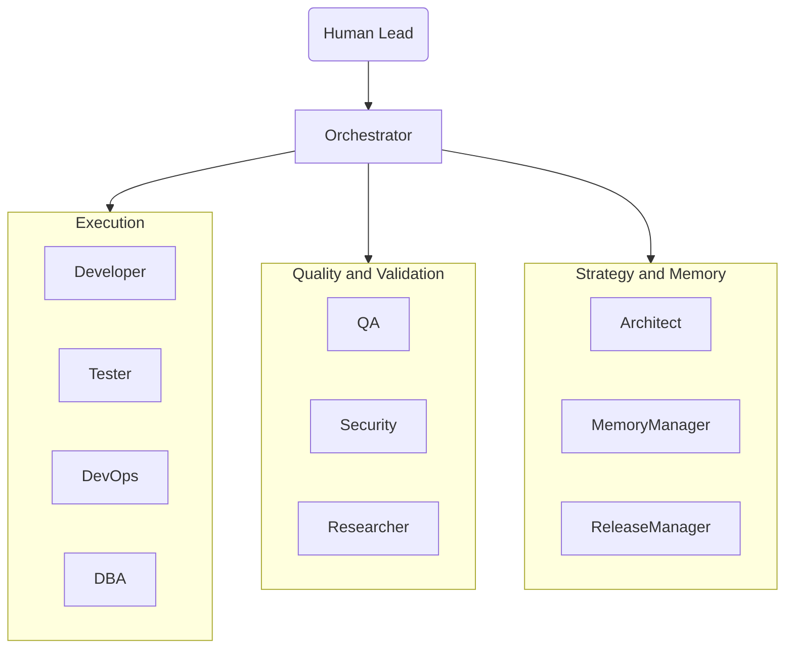
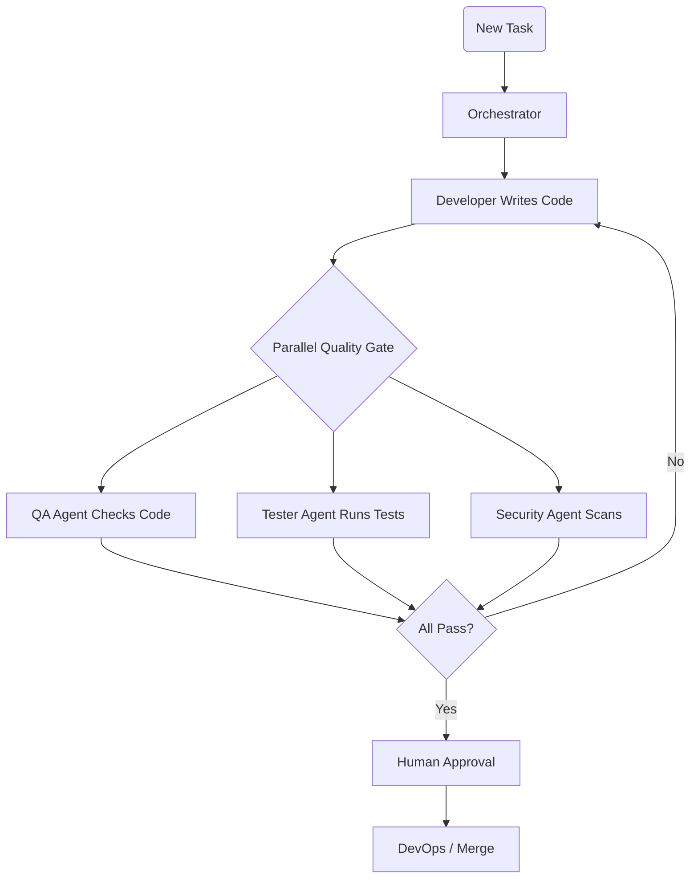
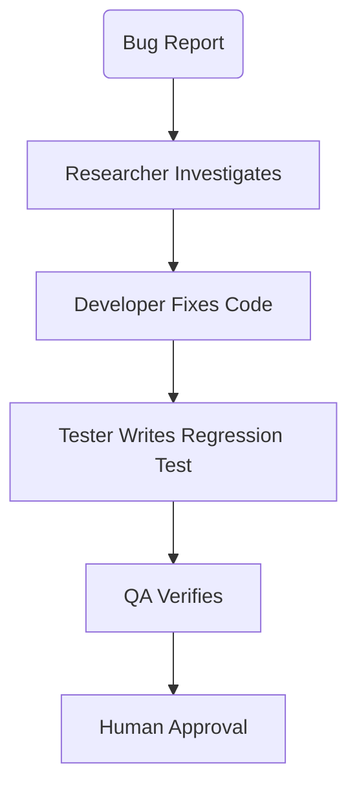
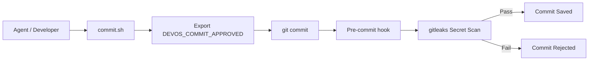
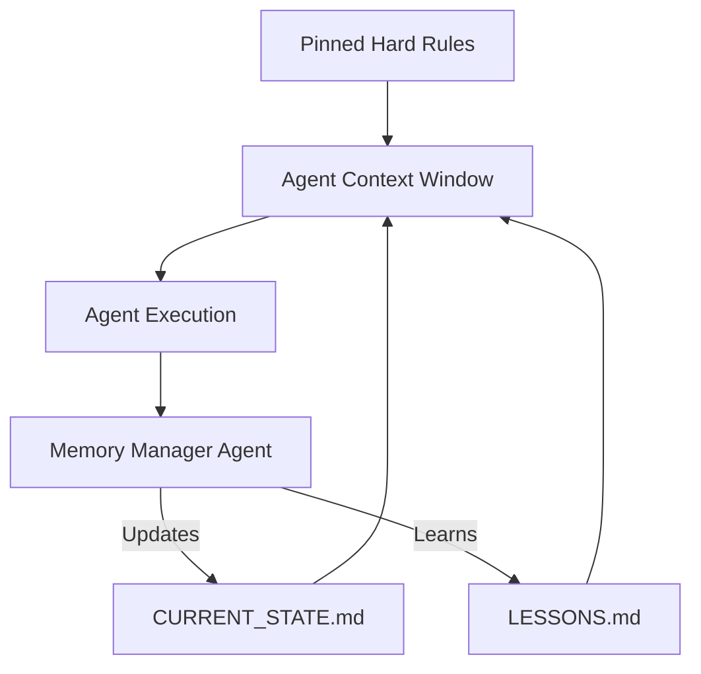
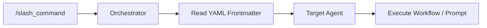

# Dev-OS System Architecture

## System Architecture Overview

Dev-OS uses a multi-agent hierarchy orchestrated by a central coordinator (the Orchestrator). AI outputs are isolated by role and validated by parallel agents before human review.

### Agent Hierarchy and Communication Flow

### Standard Feature Delivery (Parallel Gate)

### Bug Fix Workflow

### Commit Gate Flow

### Memory System Architecture

### Slash Command Routing

## Directory Structure

- `.agents/`: The core logic of the OS.
  - `agents/`: System prompts for each agent.
  - `commands/`: Slash commands.
  - `skills/`: Agent capabilities.
  - `scripts/`: Tooling (e.g., `commit.sh`).
- `docs/`: User documentation.
- `src/` (or similar): The actual project source code being managed.
