# Dev-OS System Architecture

## System Architecture Overview

Dev-OS uses a multi-agent hierarchy orchestrated by a central coordinator (the Orchestrator). AI outputs are isolated by role and validated by parallel agents before human review.

### Agent Hierarchy and Communication Flow

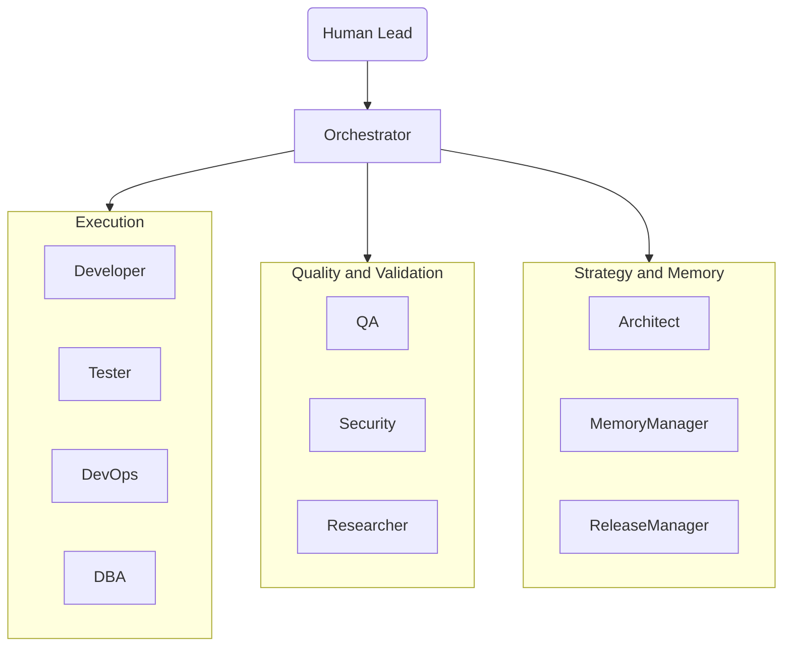

### Standard Feature Delivery (Parallel Gate)

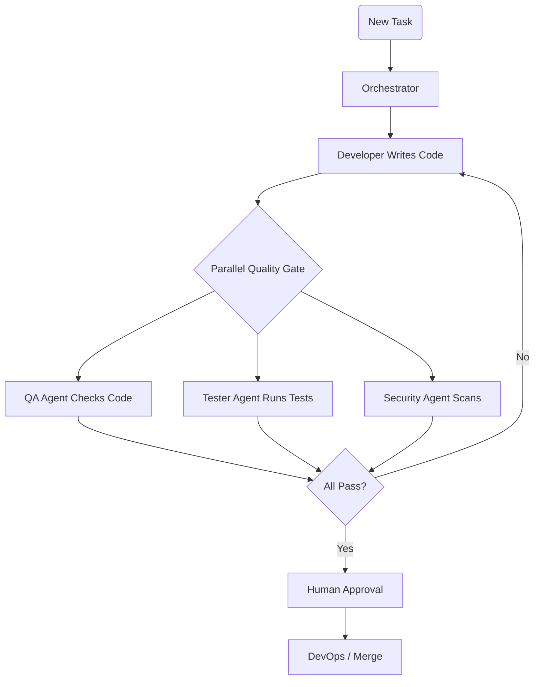

### Bug Fix Workflow

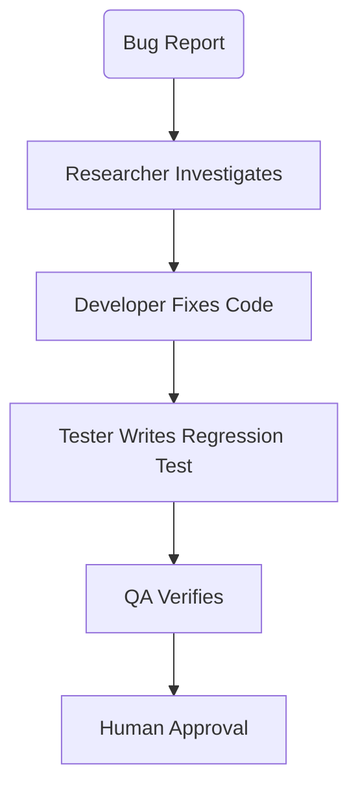

### Commit Gate Flow

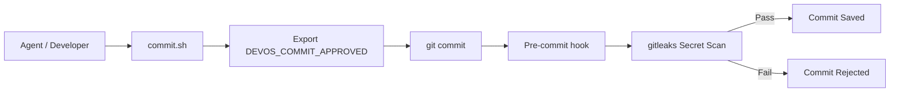

### Memory System Architecture

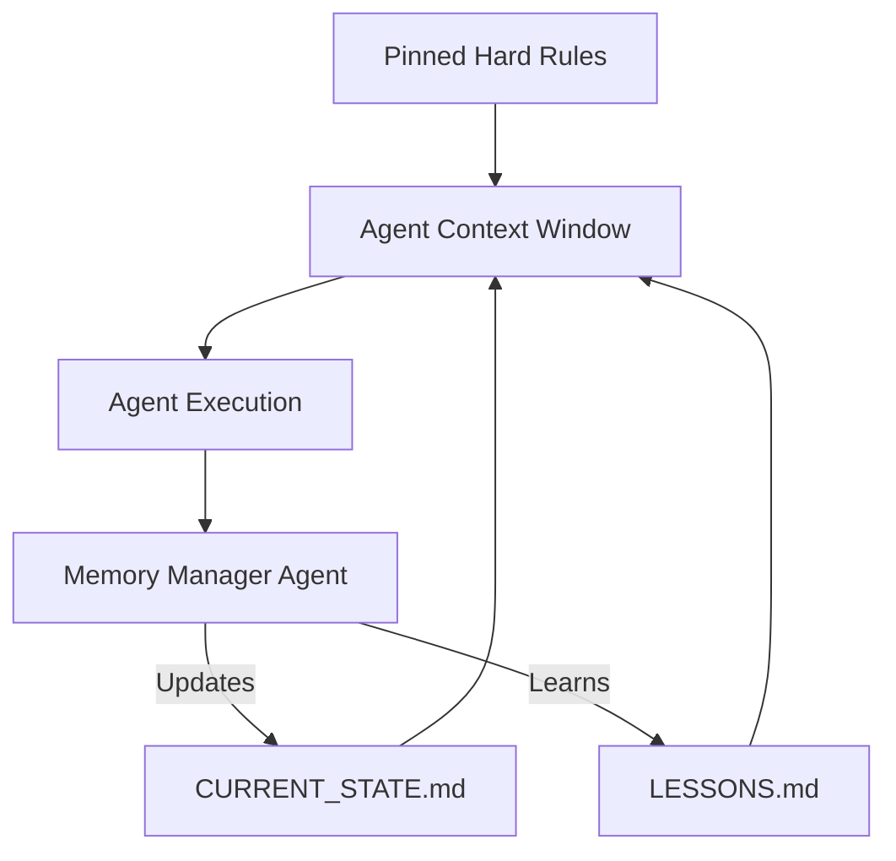

### Slash Command Routing

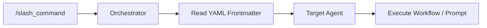

### Runtime Lifecycle Hooks Flow (F1)

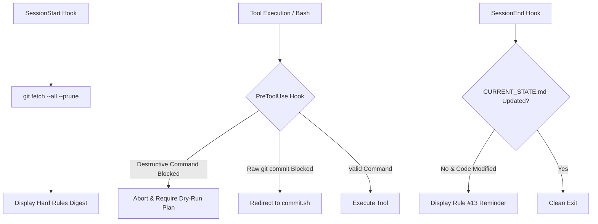

### Deterministic Task Board & DAG State (F4)

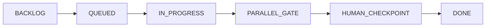

### Multi-Harness Engine (F5)

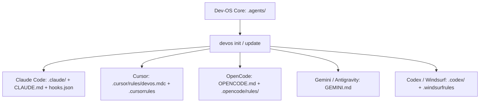

### Autonomous SDLC & Mandatory Design Gate (v4.0)

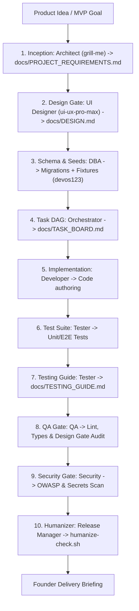

### Telemetry & Root Cause Analysis (RCA) Feedback Loop

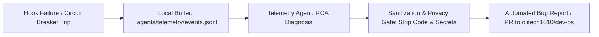

## Directory Structure

- `.agents/`: The core logic of the OS.
  - `agents/`: System prompts for each agent persona (Orchestrator, Developer, QA, Tester, DBA, DevOps, Architect, Researcher, Memory Manager, Release Manager, UI Designer, Executive Proxy, Telemetry, Eval Engineer).
  - `commands/`: Slash commands (YAML frontmatter + instructions: `task.md`, `auto.md`, `design.md`, `humanize.md`, `telemetry.md`, etc.).
  - `skills/`: Specialist engineering skills (`humanizer/`, `testing-guide/`, `autonomous-sdlc/`, `telemetry/`, etc.).
  - `hooks/`: Runtime lifecycle hooks (`session-start.sh`, `pre-tool-use.sh`, `session-end.sh`).
  - `memory/`: Shared memory vault (`decisions/ADRs`, `handoffs/`, `context.json`).
  - `telemetry/`: Local failure event buffer (`events.jsonl`).
  - `scripts/`: Tooling (`commit.sh`, `install-hooks.sh`, `humanize-check.sh`).
  - `packs.json`: Composable capability pack definitions.
  - `manifest.json`: Installed pack tracking, execution mode, telemetry configuration, and version metadata.
- `docs/`: Project documentation.
  - `DESIGN.md`: Mandatory design system specification extracted from `ui-ux-pro-max`.
  - `TESTING_GUIDE.md`: Interactive human walkthrough guide with seed accounts and universal password `devos123`.
  - `TASK_BOARD.md`: Deterministic DAG task board state machine.
  - `CURRENT_STATE.md`: Single source of truth for active tasks and blockers.
  - `LESSONS.md`: Episodic memory and incident learnings.
- Multi-Harness Outputs:
  - `.claude/`: Claude Code commands, agents, and lifecycle hooks.
  - `.cursor/rules/`: Cursor MDC rule definition.
  - `.opencode/`: OpenCode configuration and rules.
  - `CLAUDE.md`, `OPENCODE.md`, `GEMINI.md`: Root harness guidance.

