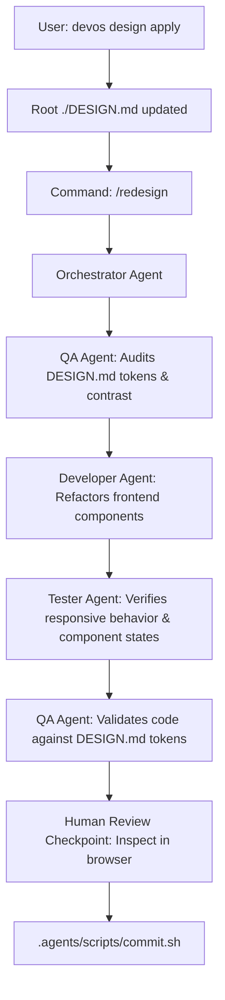

# Awesome Design Catalog & UI Redesign Guide

Dev-OS integrates a curated collection of 74 production design systems from [`VoltAgent/awesome-design-md`](https://github.com/voltagent/awesome-design-md). Each specification adheres to the Google Stitch `DESIGN.md` standard, providing verified color tokens, typography scales, component definitions, elevation levels, and design rules.

---

## 1. Why Authentic Design Systems?

Generating frontend styling with large language models often produces generic results: predictable grey-and-blue cards, arbitrary spacing increments, and inconsistent typography.

By sourcing specifications from battle-tested production platforms (such as Linear, Stripe, Supabase, Vercel, Apple, and Airbnb), Dev-OS enables engineering teams to establish a cohesive visual identity immediately:
- **Zero Hallucination:** Tokens reflect real production implementations.
- **Offline & Instant:** All 74 systems and search indexes are bundled locally in `.agents/catalog/design-systems/`.
- **Pre-Checked for Quality:** Formatted to pass `.agents/scripts/ui-taste-check.sh` and satisfy the Mandatory Design Gate out of the box.

---

## 2. Catalog Structure & Verticals

The catalog is stored locally in the project repository:

```
.agents/catalog/design-systems/
├── index.json               # Fast search index (metadata, categories, tags, keywords)
└── systems/                 # 74 ready-to-use DESIGN.md files
    ├── linear.app/
    │   └── DESIGN.md
    ├── stripe/
    │   └── DESIGN.md
    ├── supabase/
    │   └── DESIGN.md
    └── ... (74 brand systems)
```

### The 8 Industry Verticals

| Vertical | Count | Example Brands |
| :--- | :--- | :--- |
| **AI & LLM Platforms** | 12 | Claude, Cohere, ElevenLabs, Mistral AI, Ollama, OpenCode AI, Runway, xAI |
| **Developer Tools & IDEs** | 16 | Linear, Supabase, Vercel, GitHub, Raycast, Docker, Postman, Sentry, ClickHouse |
| **Fintech & Crypto** | 7 | Stripe, Revolut, Coinbase, Binance, Kraken, Mastercard, Wise |
| **Design & Creative Tools** | 6 | Figma, Framer, Airtable, Clay, Miro, Webflow |
| **E-commerce & Retail** | 5 | Shopify, Airbnb, Nike, Starbucks, Meta |
| **Media & Consumer Tech** | 12 | Apple, Spotify, The Verge, WIRED, Uber, SpaceX, NVIDIA, PlayStation, HP |
| **Automotive** | 7 | Tesla, BMW, Ferrari, Bugatti, Lamborghini, Renault, BMW M |
| **Retro Web · Nostalgia** | 2 | Dell (1996), Nintendo (2001) |

---

## 3. CLI Command Reference

### `devos design list [category]`
List all 74 systems or filter by industry vertical:

```bash
# List all systems grouped by vertical
devos design list

# Filter by vertical
devos design list devtools
devos design list fintech
devos design list ai
```

### `devos design match "<query>" [options]`
Search the catalog using keyword and domain scoring:

```bash
# Interactive selection (TTY prompt)
devos design match "b2b real-time operations dashboard"

# Headless / Agent execution (auto-select top match)
devos design match "issue tracker dark mode" --pick 1

# Output matches as JSON
devos design match "payment billing" --json
```

### `devos design apply <id>`
Directly copy a brand specification to root `./DESIGN.md`:

```bash
# Apply Linear's design system
devos design apply linear

# Apply Stripe's design system
devos design apply stripe

# Apply Supabase's design system
devos design apply supabase
```

Running `apply` writes `./DESIGN.md` to the project root and immediately satisfies the Mandatory Design Gate hook (`.agents/hooks/pre-tool-use.sh`).

### `devos design sync`
Refresh the local catalog from upstream `VoltAgent/awesome-design-md`:

```bash
devos design sync
```

---

## 4. Multi-Agent UI Redesign Workflow (`/redesign`)

When you update or replace `DESIGN.md` in an existing project, Dev-OS coordinates a structured multi-agent redesign:



### Execution Steps
1. **Apply the New Spec:**
   ```bash
   devos design apply <brand>
   ```
2. **Trigger the Redesign:**
   Run `/redesign` in your AI harness, or instruct the Orchestrator:
   > "Please redesign the frontend components to match the updated DESIGN.md"
3. **Developer Refactoring Scope:**
   - Adapts color variables, font families, button styles, cards, and spacing to match the new spec.
   - **Preservation Boundary:** Backend APIs, controllers, database schemas, and state logic remain strictly untouched.
4. **Tester & QA Verification:**
   - Tester runs automated test suites to ensure zero functional regression.
   - QA audits responsive breakpoints and checks against `.agents/scripts/ui-taste-check.sh`.
5. **Human Checkpoint:**
   - Inspect the visual changes in the browser.
   - Commit via `.agents/scripts/commit.sh`.
