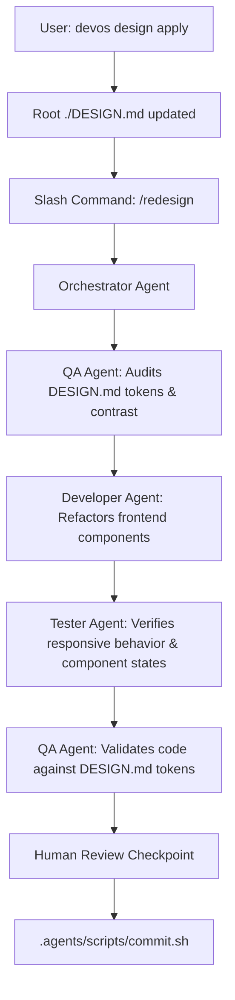

# Design Specification: Awesome Design Catalog Integration & UI Redesign Engine

- **Date:** 2026-09-27
- **Author:** Engineering Lead & UI Designer
- **Status:** Approved
- **Repository Reference:** [VoltAgent/awesome-design-md](https://github.com/voltagent/awesome-design-md)

---

## 1. Executive Summary

Dev-OS requires a deterministic, authentic foundation for the Mandatory Design Gate (`DESIGN.md`). Instead of generating design specifications procedurally or with large language models, this system integrates the curated collection of 74 production design systems from `VoltAgent/awesome-design-md`.

This integration provides:
1. A bundled catalog of 74 brand design systems indexed by industry vertical and tags.
2. CLI commands (`devos design list`, `devos design match`, `devos design apply`) to query and copy matching systems directly into root `DESIGN.md`.
3. An upstream sync script (`scripts/sync-design-catalog.js`) to fetch updates from the upstream repository.
4. An orchestrated multi-agent UI redesign workflow where the Orchestrator coordinates QA, Developer, and Tester to refactor an existing application UI to match the chosen design system.

---

## 2. Goals and Non-Goals

### Goals
- **Eliminate AI UI Hallucination:** Replace procedural generation with real, production-tested design systems (such as Linear, Stripe, Supabase, Vercel, Apple, and Airbnb).
- **Offline Reliability:** Bundle the catalog and index inside Dev-OS (`.agents/catalog/design-systems/`) so matching and export work with zero network latency and full air-gap support.
- **Fast CLI & Agent Workflow:** Enable single-command matching and direct application from both interactive terminal sessions and autonomous agent pipelines.
- **Strict Quality Enforcement:** Verify exported `DESIGN.md` documents against `.agents/scripts/ui-taste-check.sh` and satisfy the Mandatory Design Gate hook.
- **Safe UI Redesign Protocol:** Establish a workflow for redesigning existing codebases without altering backend logic, database schemas, or API contracts.

### Non-Goals
- Modifying backend endpoints, controllers, database models, or business logic during UI redesign tasks.
- Forcing mandatory online connectivity for design matching.

---

## 3. Catalog Architecture & Directory Layout

The design catalog resides at `.agents/catalog/design-systems/`:

```
.agents/catalog/design-systems/
├── index.json               # Fast search index (metadata, categories, tags, keywords)
└── systems/                 # 74 ready-to-use DESIGN.md files
    ├── airbnb/
    │   └── DESIGN.md
    ├── claude/
    │   └── DESIGN.md
    ├── linear/
    │   └── DESIGN.md
    ├── stripe/
    │   └── DESIGN.md
    ├── supabase/
    │   └── DESIGN.md
    ├── vercel/
    │   └── DESIGN.md
    └── ... (74 brands across 8 categories)
```

### Search Index Schema (`index.json`)
The catalog index maps each design system to searchable metadata:

```json
[
  {
    "id": "linear",
    "name": "Linear",
    "category": "Developer Tools & IDEs",
    "summary": "High-velocity issue tracking. Ultra-dark obsidian canvas, subtle purple/indigo accents, crisp borders, compact data density.",
    "keywords": ["issue tracker", "project management", "dark mode", "high density", "developer tool", "minimalist", "keyboard-first"],
    "primaryColor": "#5e6ad2",
    "backgroundColor": "#0d0e11",
    "path": "systems/linear/DESIGN.md"
  },
  {
    "id": "stripe",
    "name": "Stripe",
    "category": "Fintech & Crypto",
    "summary": "Financial infrastructure platform. Deep navy ink, electric indigo primary, signature gradient mesh, and weight-300 typography.",
    "keywords": ["payments", "billing", "fintech", "banking", "finance", "gradients", "clean", "developer"],
    "primaryColor": "#533afd",
    "backgroundColor": "#ffffff",
    "path": "systems/stripe/DESIGN.md"
  }
]
```

### Categories (8 Verticals)
1. **AI & LLM Platforms** (Claude, Cohere, ElevenLabs, Mistral AI, Ollama, OpenCode AI, Replicate, Runway, Together AI, VoltAgent, xAI, Minimax)
2. **Developer Tools & IDEs** (Linear, Supabase, Vercel, GitHub, Raycast, Docker, Postman, Sentry, Grafana, Cloudflare, Warp, Resend, PostHog, Mintlify, ClickHouse, Expo, HashiCorp, Sanity)
3. **Fintech & Crypto** (Stripe, Revolut, Coinbase, Binance, Kraken, Mastercard, Wise)
4. **Design & Creative Tools** (Figma, Framer, Airtable, Clay, Miro, Webflow)
5. **E-commerce & Retail** (Shopify, Airbnb, Nike, Starbucks, Meta)
6. **Media & Consumer Tech** (Apple, Spotify, The Verge, WIRED, Uber, SpaceX, NVIDIA, PlayStation, HP, IBM, Pinterest, Vodafone)
7. **Automotive** (Tesla, BMW, Ferrari, Bugatti, Lamborghini, Renault, BMW M)
8. **Retro Web / Nostalgia** (Dell 1996, Nintendo 2001)

---

## 4. CLI Interface & Discovery Engine

The `devos design` CLI suite provides three primary operations:

### 1. `devos design list [category]`
Lists available design systems grouped by category or filtered by vertical:
- `devos design list`
- `devos design list devtools`
- `devos design list fintech`

### 2. `devos design match "<query>" [options]`
Scans the catalog index using token-overlap and keyword scoring:
- **Interactive Mode:** Prompts the user to pick from the top 3-5 candidates.
- **Headless Mode (`--pick <index>` or `--pick <id>`):** Automatically selects and applies the choice without blocking TTY.
- **Machine Output (`--json`):** Returns candidate list as JSON for agent consumption.

```bash
# Interactive selection
devos design match "issue tracker for developers"

# Agent / Script invocation
devos design match "saas billing dashboard" --pick stripe
```

### 3. `devos design apply <id>`
Direct application of a known design system ID:
```bash
devos design apply supabase
```

Execution steps for `apply`:
1. Locates `systems/<id>/DESIGN.md` in the catalog.
2. Writes the file contents directly to `./DESIGN.md` at project root.
3. Executes `.agents/scripts/ui-taste-check.sh` on the newly written file.
4. Outputs verification status and unblocks the `.agents/hooks/pre-tool-use.sh` gate.

---

## 5. Upstream Catalog Synchronization

A zero-dependency Node.js script, `scripts/sync-design-catalog.js`, handles synchronization with `https://github.com/VoltAgent/awesome-design-md`:

- Clones or fetches `VoltAgent/awesome-design-md` via GitHub API / archive tarball.
- Parses each directory under `design-md/`, extracting metadata from the YAML frontmatter and README.
- Generates `.agents/catalog/design-systems/index.json`.
- Copies each `DESIGN.md` into `.agents/catalog/design-systems/systems/<id>/DESIGN.md`.
- Verifies all 74 systems pass file integrity checks.

---

## 6. Multi-Agent Orchestration: UI Redesign Protocol

When a user runs `devos design apply <id>` (or `devos design match`) in an existing project, the root `DESIGN.md` changes. To execute the redesign cleanly:



### Agent Responsibilities
1. **Orchestrator:** Coordinates the redesign sequence, manages iteration count, and surfaces blockers.
2. **QA Agent:**
   - Validates that `DESIGN.md` contains complete tokens (colors, type scale, spacing, buttons, inputs).
   - Validates final code against `CODING_STANDARDS.md` and `DESIGN.md`.
3. **Developer Agent:**
   - Inspects existing component files (`*.tsx`, `*.jsx`, `*.vue`, `*.html`, `*.css`).
   - Updates color variables, font families, button styles, cards, and spacing according to `DESIGN.md`.
   - Strictly preserves existing business logic, server actions, API calls, and state management.
4. **Tester Agent:**
   - Tests visual rendering across breakpoints (mobile, tablet, desktop).
   - Verifies interactive states (hover, focus-visible, active).
   - Runs existing automated test suites to confirm no regressions.
5. **Human Checkpoint:**
   - Reviews modified files and tests UI in the browser.
   - Triggers commit via `.agents/scripts/commit.sh`.

---

## 7. Verification and Testing Plan

1. **Catalog Integrity Smoke Test:** Add assertions in `scripts/smoke-test.js` checking that `.agents/catalog/design-systems/index.json` contains 74 entries and that all target files exist.
2. **CLI Suite Verification:** Test `devos design list`, `devos design match "payments" --json`, and `devos design apply stripe` in temporary test workspaces.
3. **Mechanical Scanners:**
   - Run `.agents/scripts/ui-taste-check.sh` on all 74 catalog `DESIGN.md` files.
   - Run `.agents/scripts/humanize-check.sh` on this specification and all new documentation.
4. **Handoff Smoke Test:** Verify that creating/modifying a frontend file is permitted once `devos design apply` creates `DESIGN.md`.
